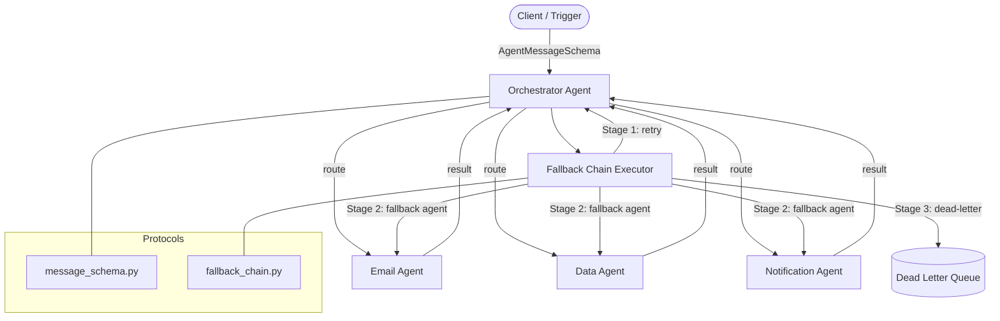

# Multi-Agent Orchestration Framework — Architecture Document

**Version**: 1.0.0  
**Status**: Active  
**Owner**: Muhammad Ahmad  

---

## 1. Overview

A modular, async-first orchestration framework that routes business workflow tasks
across specialised agents with typed message contracts, exponential-backoff retry,
and a 3-stage error-recovery fallback chain.

---

## 2. Architecture Pattern

**Pattern**: Pipe-and-Filter + Supervisor/Worker  
**Justification**: Each agent is a stateless filter; the orchestrator is the supervisor
that routes, retries, and escalates — cleanly separating routing logic from business logic.

---

## 3. System Component Diagram

---

## 4. Inter-Agent Communication Protocol

All agents communicate exclusively via `AgentMessageSchema` (Pydantic v2).  
No agent holds a direct reference to another — all calls go through the orchestrator.
---

## 5. Error-Recovery Fallback Chain
execute(message)

│

▼

┌─────────────────────────────────────┐

│  STAGE 1 — RETRY                    │

│  max 3 attempts                     │

│  exponential backoff                │

│  0.5s → 1.0s → 2.0s (capped 8s)   │

└──────────────┬──────────────────────┘

│ all retries exhausted

▼

┌─────────────────────────────────────┐

│  STAGE 2 — FALLBACK CHAIN           │

│  walk fallback_chain[] in order     │

│  skip missing registry entries      │

│  stop on first success              │

└──────────────┬──────────────────────┘

│ all fallbacks failed

▼

┌─────────────────────────────────────┐

│  STAGE 3 — DEAD-LETTER QUEUE        │

│  log + persist entry                │

│  swap _persist() → Redis/DB         │

│  manual review / alert trigger      │

└─────────────────────────────────────┘
---

## 6. Agent Catalogue

| Agent | Name (registry key) | Supported Operations | Fallback Target |
|-------|-------------------|---------------------|-----------------|
| OrchestratorAgent | `orchestrator` | Route, supervise, queue | — |
| EmailAgent | `email_agent` | Send email | `notification_agent` |
| DataAgent | `data_agent` | fetch, transform, persist | — |
| NotificationAgent | `notification_agent` | sms, push, webhook | — |

---

## 7. Workflow Execution Modes

| Mode | Method | Use Case |
|------|--------|----------|
| Sequential | `run_workflow()` | Steps with dependencies |
| Parallel | `run_parallel()` | Independent steps |
| Queue-based | `enqueue()` + `process_queue()` | High-volume async dispatch |

---

## 8. Message Status Lifecycle
PENDING → IN_FLIGHT → SUCCESS

↘ FAILED → DEAD_LETTER
---

## 9. Bottleneck & Failure Analysis

| # | Component | Risk | Mitigation |
|---|-----------|------|------------|
| BN-01 | OrchestratorAgent | Single point of routing failure | Stateless design allows horizontal scale-out |
| BN-02 | DeadLetterQueue | In-memory — lost on restart | Swap `_persist()` with Redis `LPUSH` |
| BN-03 | asyncio.sleep (mock I/O) | Not production I/O | Replace with real SMTP/DB/webhook clients |
| BN-04 | Registry lookup `O(1)` dict | None at current scale | Monitor if registry exceeds 100+ agents |
| BN-05 | Retry backoff (0.5s base) | Latency amplification under load | Tune `RetryPolicy` per agent SLA |

---

## 10. Extension Points

| What to extend | Where | How |
|----------------|-------|-----|
| Add new agent | `agents/worker_agents/` | Subclass `BaseAgent`, implement `handle()`, register with orchestrator |
| Add task type | `protocols/message_schema.py` | Add entry to `TaskType` enum |
| Persist DLQ | `protocols/fallback_chain.py` | Replace `_persist()` with Redis/DB write |
| Real message queue | `agents/orchestrator_agent.py` | Swap `asyncio.Queue` with Redis Streams or Kafka consumer |
| Workflow as config | `workflows/` | Define steps as YAML/JSON, parse into `AgentMessageSchema` list |

---

## 11. File Structure
multi-agent-orchestration-framework/

├── agents/

│   ├── base_agent.py              # AgentMessage dataclass + BaseAgent ABC

│   ├── orchestrator_agent.py      # Routing, registry, workflow execution

│   └── worker_agents/

│       ├── email_agent.py

│       ├── data_agent.py

│       └── notification_agent.py

├── protocols/

│   ├── message_schema.py          # Pydantic v2 schema + enums

│   └── fallback_chain.py          # RetryPolicy, DLQ, FallbackChainExecutor

├── workflows/

│   └── sample_workflow.py         # Sequential, parallel, failure simulation

├── docs/

│   └── architecture.md            # This document

├── tests/

│   └── test_orchestrator.py       # 28 unit tests across all modules

└── requirements.txt
---

## 12. ADR — Architecture Decision Records

### ADR-01: Pydantic v2 for Message Validation
**Status**: Accepted  
**Context**: Inter-agent messages cross module boundaries; silent type errors cause hard-to-debug failures.  
**Decision**: All messages validated via `AgentMessageSchema` (Pydantic v2) before dispatch.  
**Consequences**: ~2ms validation overhead per message; acceptable at current scale.

### ADR-02: asyncio over Threading
**Status**: Accepted  
**Context**: Agent tasks are I/O-bound (SMTP, DB, webhooks) not CPU-bound.  
**Decision**: `asyncio` for all agent execution; `asyncio.gather` for parallelism.  
**Consequences**: Cannot run CPU-heavy tasks without `run_in_executor`; acceptable for current agent types.

### ADR-03: In-Memory DLQ with Swap Point
**Status**: Accepted  
**Context**: Redis dependency adds ops overhead for initial implementation.  
**Decision**: In-memory DLQ with isolated `_persist()` method as Redis swap point.  
**Consequences**: DLQ entries lost on restart; acceptable for dev/test; production requires Redis.
